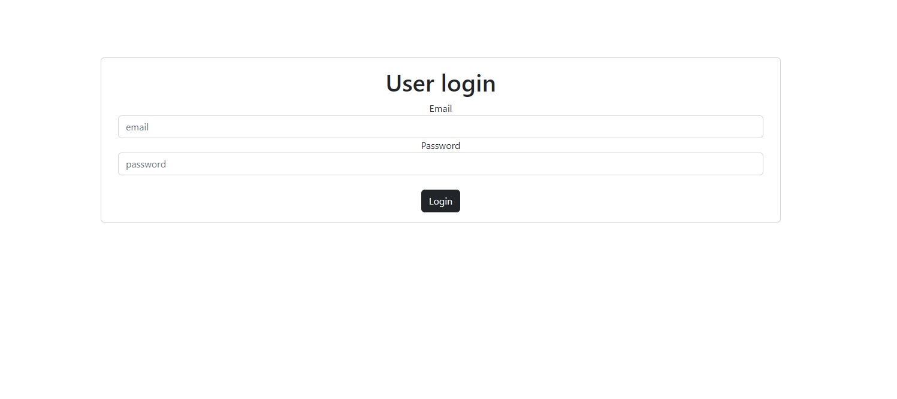
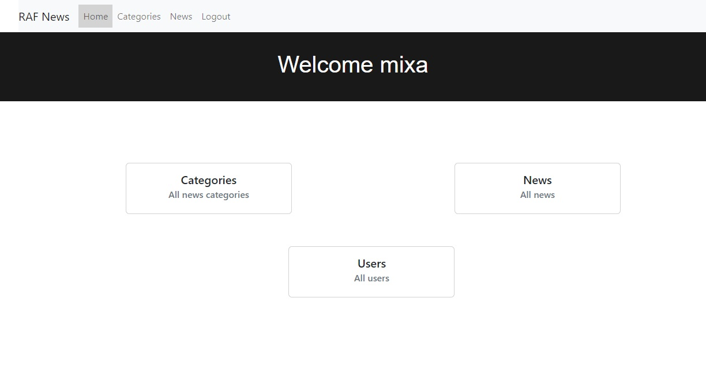
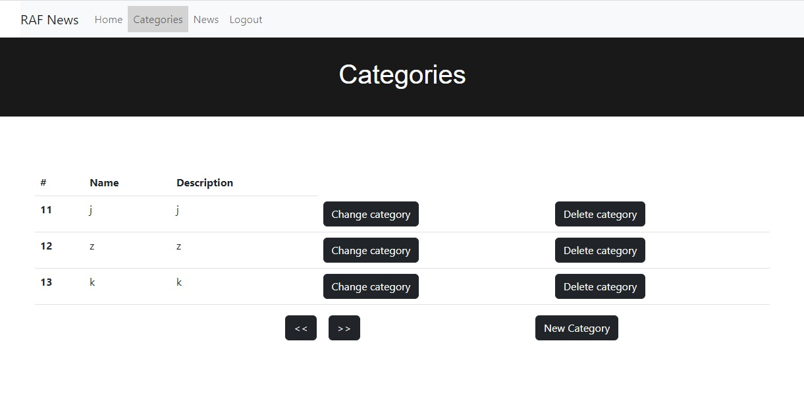
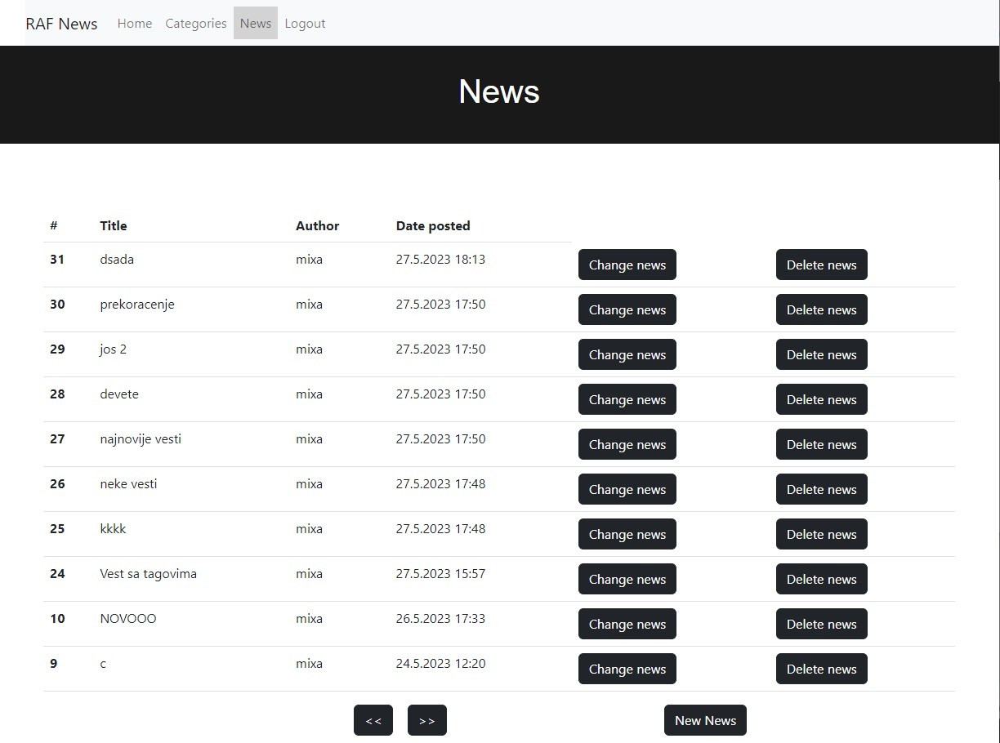
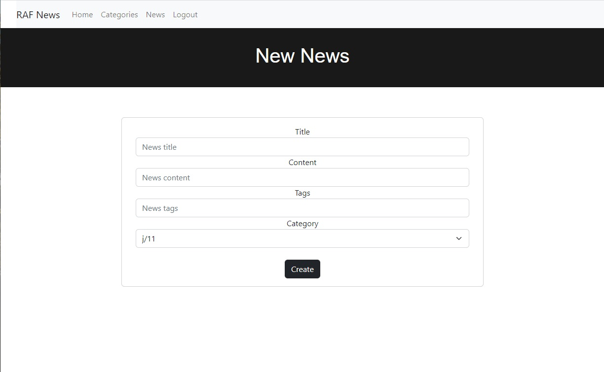
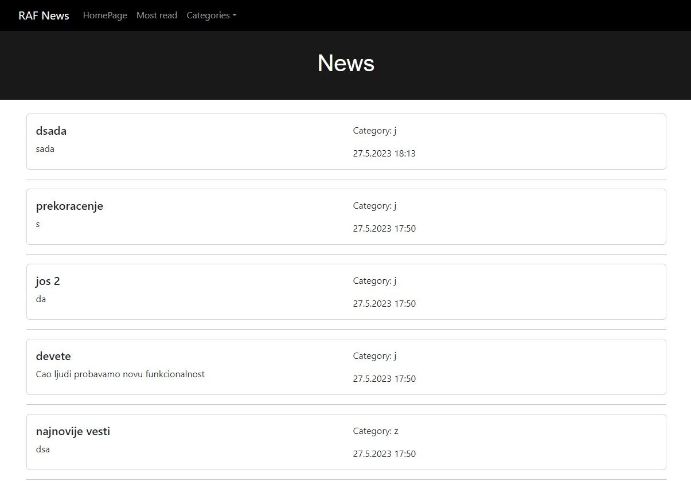
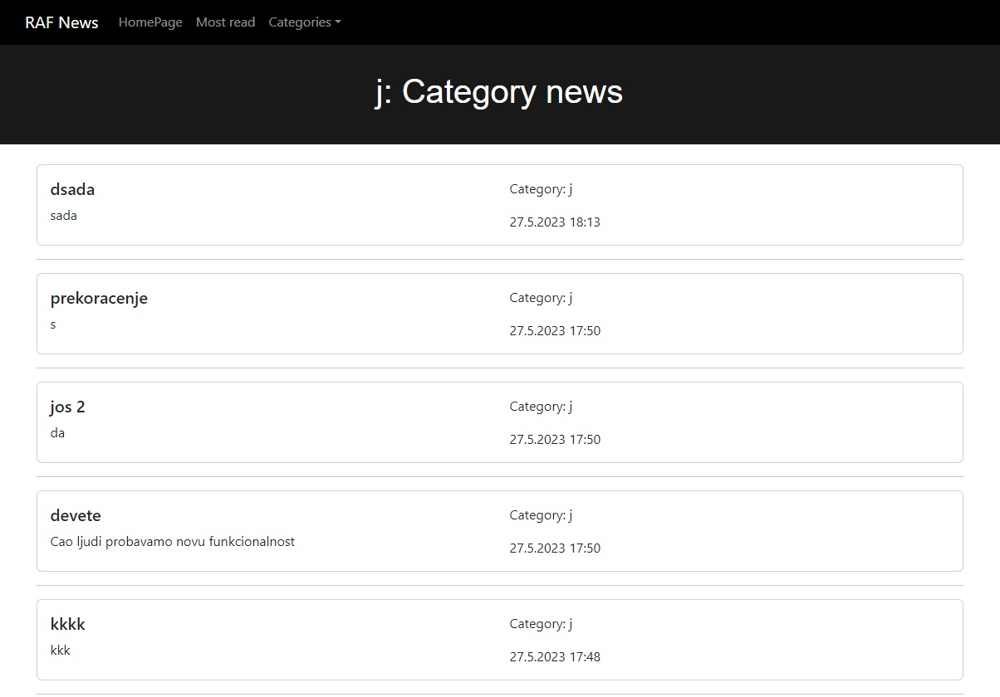
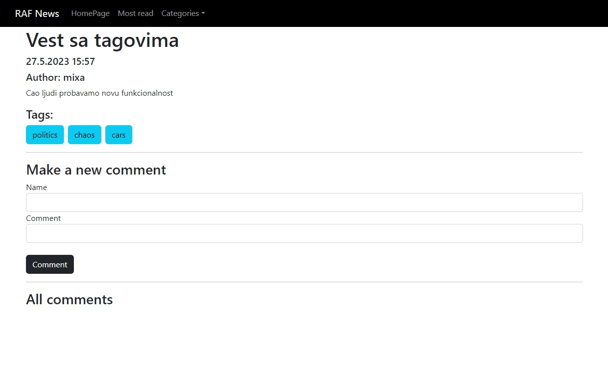
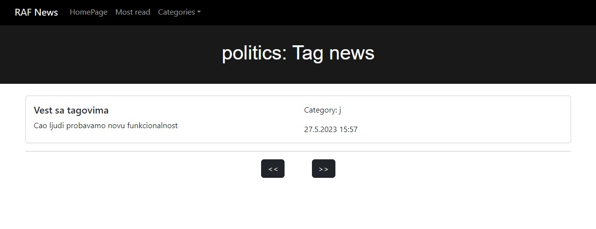

# RAF-News

This is a university project of a full-stack website for managing news. It has a dedicated CMS for two types of users (Admin/Content-Creator). 
Both Admins and Content-Creators can add News, Categories (which have News), update them, delete them. The difference between this two users is that Admins
can also do these operations on Users. 
 
Admins can also deactive certain CMS users (not other admins).  
 
The full documentation is in the "Web programiranje.docx" file.
 
The back-end of this page was made using java, JAX-RS with a TomCat server. 
The front-end was made in Vue 2 with the help of Bootstrap. 
 
Here are the corresponding pages for the CMS: 
 
Login:

Home page (as you can see there is a tab button for users because i've loged in with a Admin account):

Categories page:

Add new category(same as change category):

News page:

Add news page(same as change news):

And then we have the users platform where people can read news, find the most read ones or find the news in a given category:

Most read news in the last 30 days:

News sorted by category:

Detailed view of the news, people can also add comments here without loging in:

If you click on any of the tags on the detailed view of the news it will take you to all the news with that tag:

